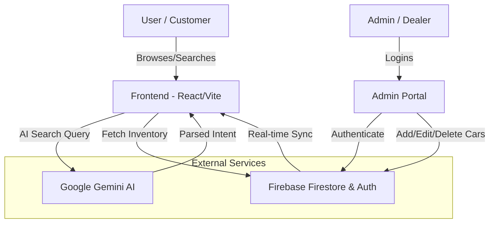

# Carz-34 - Trusted Pre-Owned Cars in Chandrapur

Carz-34 is a premium business website for Chandrapur's leading second-hand automobile dealer. The platform provides a seamless experience for buyers to browse, search, and inquire about high-quality pre-owned vehicles.

## 🚗 Website Information

*   **Business Name:** Carz-34
*   **Tagline:** Trusted Pre-Owned Cars in Chandrapur. Quality assured, price guaranteed.
*   **Location:** Civil Lines, Near District Court, Chandrapur, Maharashtra 442401
*   **Contact:** +91 97653 05539 
*   **Mission:** To redefine the pre-owned car buying experience through transparency, trust, and quality assurance.

### Key Features
*   **Live Inventory:** Real-time browsing of available cars with detailed specifications.
*   **AI-Powered Search:** Natural language car search powered by Google Gemini AI.
*   **Direct WhatsApp Integration:** One-click contact for instant inquiries.
*   **Admin Dashboard:** Secure portal for inventory management (Add/Edit/Delete listings).
*   **Responsive Design:** Optimized for mobile, tablet, and desktop viewing.

## 🛠 Tech Stack

*   **Frontend:** React 19, TypeScript, Tailwind CSS
*   **Icons:** Lucide React
*   **Routing:** React Router Dom (v7)
*   **Backend & Database:** Firebase (Firestore & Authentication)
*   **AI Integration:** Google Gemini API (@google/genai)
*   **Build Tool:** Vite

## 🔄 Workflow

### System Architecture

### 1. For Customers
*   **Discovery:** Users land on the Home page to view featured listings and core services.
*   **Inventory Exploration:** Browse the full catalog on the Inventory page. Use filters or the **AI Search Assistant** to find the perfect vehicle based on specific needs (e.g., "Show me fuel-efficient hatchbacks under 5 lakhs").
*   **Detailed View:** Examine car specifications, mileage, owner details, and high-resolution images on the Car Details page.
*   **Inquiry:** Connect directly with the dealer via the floating WhatsApp button or the Contact page.

### 2. For Administrators
*   **Authentication:** Secure login via the Admin Portal using Firebase Auth.
*   **Inventory Management:** 
    *   Add new car listings with images and technical details.
    *   Update existing listings (price changes, status updates).
    *   Remove sold vehicles from the live inventory.
*   **Real-time Sync:** All changes made in the admin panel reflect instantly for customers.

### 3. AI Search Logic
*   The application uses the **Gemini 3 Flash** model to parse user queries.
*   It matches user intent (budget, body type, brand) against the current inventory data.
*   Provides a curated list of recommendations, making the search process conversational and intuitive.

---

*Built with ❤️ for Carz-34 Chandrapur.*
